<!-- TOC -->

- [1. Gns3の導入方法](#1-gns3の導入方法)
  - [1.1. 目的](#11-目的)
  - [1.2. 必要なもの](#12-必要なもの)
  - [1.3. IOSイメージをダウンロードしてみよう！](#13-iosイメージをダウンロードしてみよう)
    - [1.3.1. GNS3をインストールしてみよう！](#131-gns3をインストールしてみよう)
    - [1.3.2. 動作確認してみよう！](#132-動作確認してみよう)

<!-- /TOC -->

# 1. Gns3の導入方法

## 1.1. 目的

GNS3の導入のために必要なことを示す。また今回は必要なIOS
イメージをCiscoルータからダウンロードする方針をとった。

## 1.2. 必要なもの

- MacPC
- Cisco2650XM（2600シリーズはできない機種もあるのでこれがおすすめ）
- LANケーブル
- LANポート TypeC変換ケーブル
- USBシリアル変換ケーブル(UGREEN USBが検証済み)
- ロールオーバーケーブル

## 1.3. IOSイメージをダウンロードしてみよう！


1. 上記のCONSOLEとFastEthernet0/0に、ロールオーバーケーブルとLANケーブルをそれぞれ繋げ、Macと接続する
2. ルーターに電源ケーブルを繋げる
3. パソコンの電源をつける
4. USBデバイスドライバをインストールする
[UGREENのドライバインストール](https://www.ugreen.com/)
5. インストールしたUSBドライバを確認する
   
```cs
$ls -l /dev/tty.*
```

成功したら以下が現れる

```cs
crw-rw-rw-  1 root  wheel   18,   4  7 30 21:41 /dev/tty.usbserial
```
人によって異なるので、.usebsirialと書かれている行をコピーする

6. screenコマンドを入れる

```cs
$ screen /dev/tty.usbserial
```
５でコピーした行をscreenコマンドの後に入れる

7. ルーターの電源を入れる

```cs
Last login: Tue Jul 30 21:41:57 on ttys000
XXXXXXXX-no-MacBook:~ XXXXXXXX$ screen /dev/tty.usbserial

〜〜〜〜〜〜〜〜〜〜〜
中略
〜〜〜〜〜〜〜〜〜〜〜
Initializing ATA monitor library.......

program load complete, entry point: 0x80012000, size: 0x1c2dee4
Self decompressing the image : ############################################################################################################################################################################################################################################################################ [OK]

              Restricted Rights Legend

Use, duplication, or disclosure by the Government is
subject to restrictions as set forth in subparagraph
(c) of the Commercial Computer Software - Restricted
Rights clause at FAR sec. 52.227-19 and subparagraph
(c) (1) (ii) of the Rights in Technical Data and Computer
Software clause at DFARS sec. 252.227-7013.

           cisco Systems, Inc.
           170 West Tasman Drive
           San Jose, California 95134-1706

```

上記のような文字が流れる
初めて起動したとき、Yes/Noを聞かれるがNoでOK

8. Macで別のターミナル（以下ターミナル２と記載する）を立ち上げて、以下のコマンドを入力しTFTPサーバを起動する

```cs
sudo launchctl load -w /System/Library/LaunchDaemons/tftp.plist
```

9. ターミナルにて以下のコマンドを入力する

```cs
Router>enable
Router#show flash
```
表示された

```cs
c2600-adventerprisek9-mz.124-25d.bin
```
で表示されるファイル名をコピーする

10. ターミナル２にて、以下のコマンドを入力する

```cs
% cd /private/tftpboot
% touch ./c2600-adventerprisek9-mz.124-25d.bin
% chmod 666 ./c2600-adventerprisek9-mz.124-25d.bin
```

11. ターミナルにて以下のコマンドを入力する

```cs
Router#conf t
Router(config)#interface FastEthernet 0/0
Router(config-if)#no shutdown
Router(config-if)#end
```

12. Macのシステム環境、ネットワークからUSBに割り当てられたIPアドレス、サブネットマスクを確認する

- 以下ではMacのIPアドレス192.255.255.3,サブネット255.255.255.0として進める

13. ターミナルにて以下のコマンドを入力する

```cs
Router#conf t
Router(config)#no service config
Router(config)#exit
```

ルーターを終了し、再起動する

14. ターミナルにて以下のコマンドを入力する

```cs
Router>enable
Router#conf t
Router(config)#interface FastEthenet 0/0
Router(config-if)#ip address 192.255.255.2 255.255.255.0
```
パソコンと、ルーターが同じネットワークにあるように設定する

15. ターミナルにて、以下のコマンドを入力する

```cs
Router#copy flash tftp
```

eraseとか聞いてきたらコマンド間違っているのでctr+cで抜けよう！
間違うとIOSファイルが消える

16. ターミナル２でTFTPサーバを終了する

```cs
sudo launchctl unload -w /System/Library/LaunchDaemons/tftp.plist
```

### 1.3.1. GNS3をインストールしてみよう！

- PCを諸事情でwindowsPCに変更しました
- 基本方針としてVirtualBoxをサーバとして起動させます
- VMWAREでもいいよ
- [2600のIOSイメージ](https://www.icloud.com/iclouddrive/0pJNIwzIe54Ld82lY5MIhzxZw#c2600-adventerprisek9-mz)

1. ここからWindows用をインストールしよう！
[GNS3インストーラー](https://gns3.com/software/download)

2. インストーラーを起動してインストールしよう
- 基本NextでOK
- SolarwindsはNo(メール等々めんどくさい)
- 下のNpcap、Solar-puTTYもCancelでOK
  
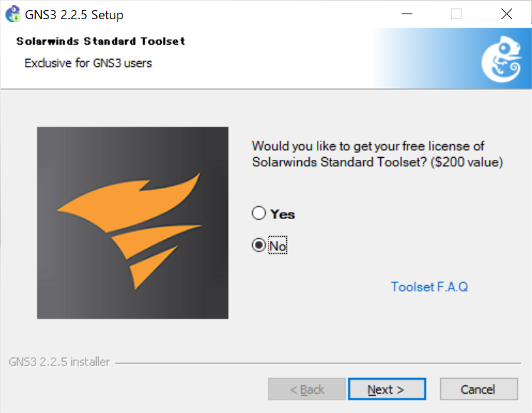

3. VirtualBox用のGNS3VMをインストールしよう

- [ここ](https://github.com/GNS3/gns3-gui/releases)からダウンロードしたバージョンのVirtualBox用のGNS3をインストールする
  - GNS3のバージョンはGNS3を起動させると以下の部分に書いてある
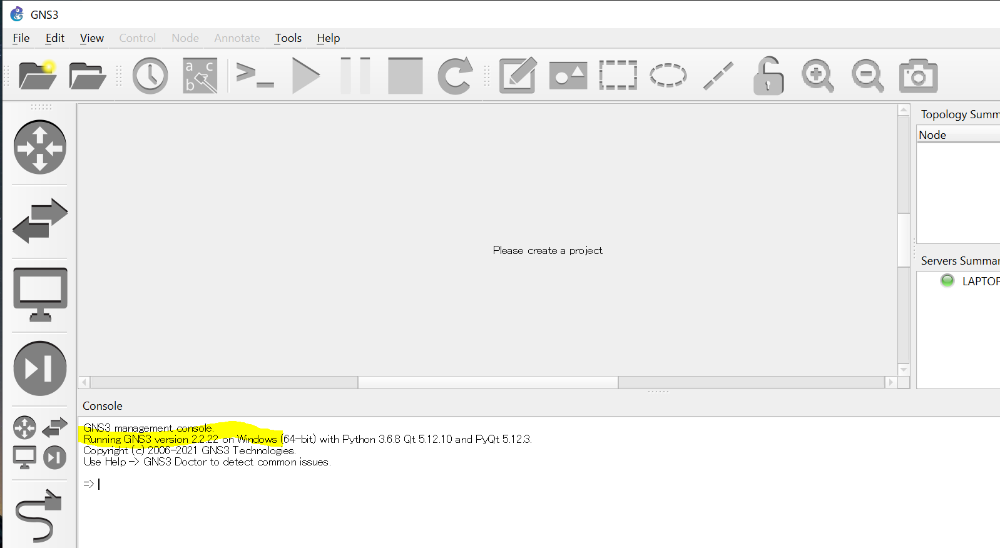

- 今回はGNS3ver2.2.22かつVirtualBoxなので以下をダウンロード
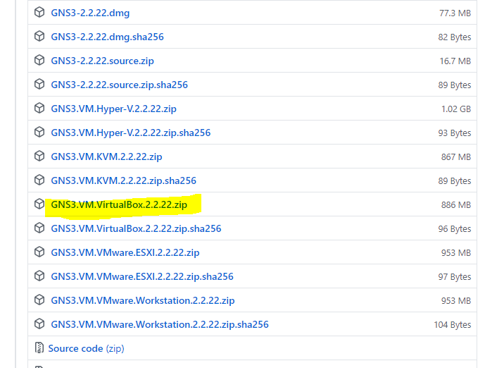

4. VirtulBoxをインストールして起動します
[VirtualBoxインストーラー](https://www.virtualbox.org/wiki/Downloads)
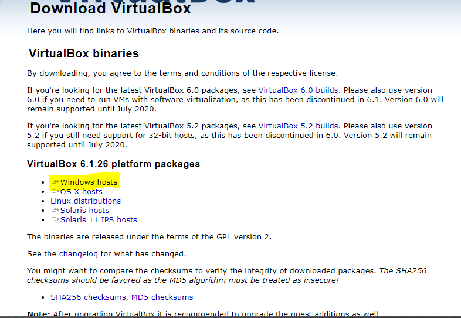

5. 起動したvirtualBoxから先ほどインストールしたGNS3VMをインポートする
- インポートするのは先ほどインストールしたzipファイルの中身の.ovaファイル

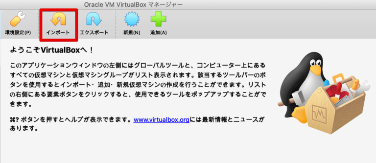

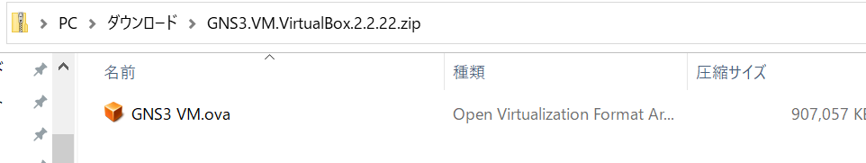

- インストールすると以下の画像のようになる

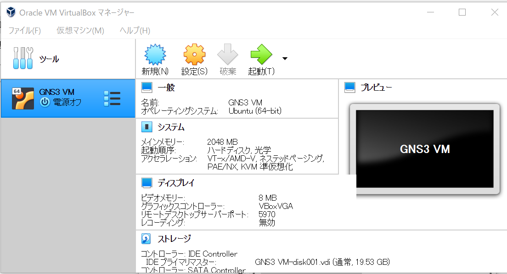

6. VMを通常起動する

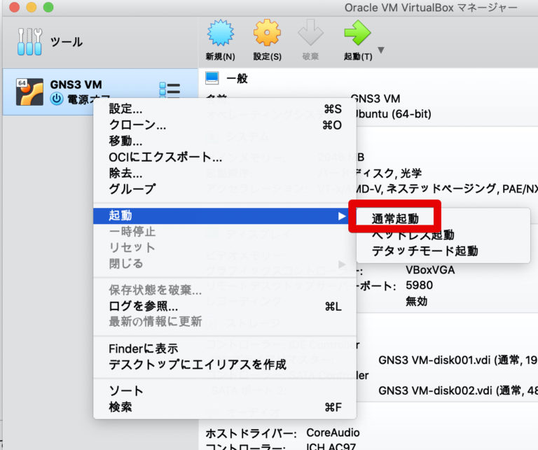

- 以下の画像が出れば起動成功

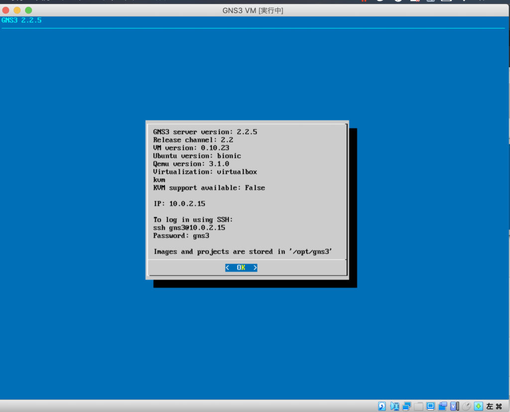

- 初回起動時以下のメッセージがですがネットワーク設定の変更>OKをクリックすればOK

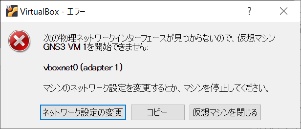

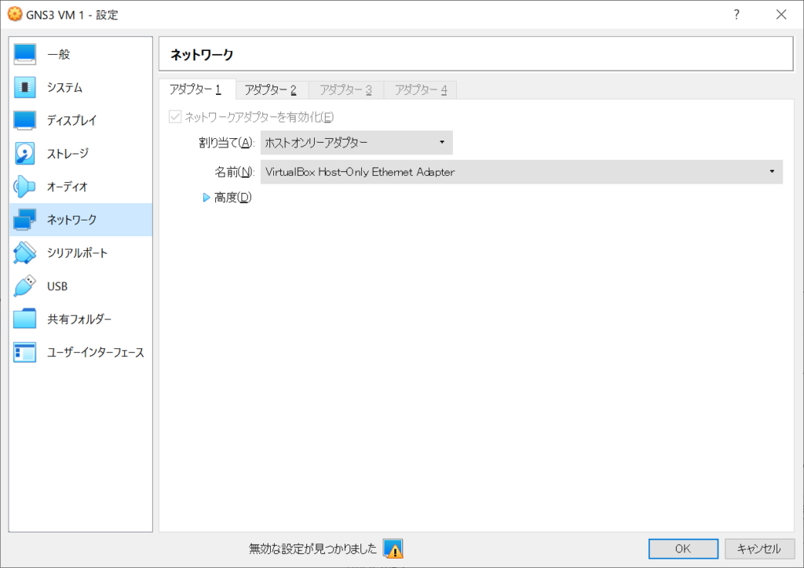

理由：上記の１つ目の画像をよく見るとGNS3 VMが、vboxnet0というインターフェイスを探しに行っているのですが、そのような名前のインターフェイスはないのでエラーになっています。

- 起動時に以下のエラーが出た場合はHyper-Vを停止する

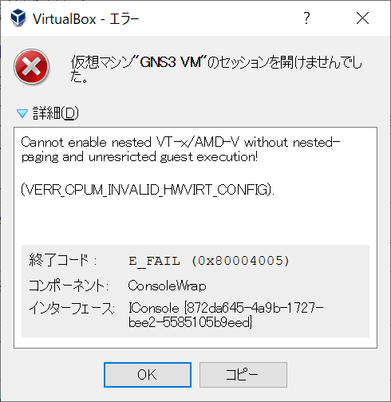

- [コントロールパネル] – [プログラムと機能] – [Windows の機能の有効化または無効化] で、Hyper-Vのチェックが外れていること

- [機能のWindowsをオンまたはオフにする] を選択します

- [Hyper-V] を展開 し 、[Hyper-V プラットフォーム] を展開し 、[Hyper-V ハイパーバイザ] チェック ボックスをオフにします
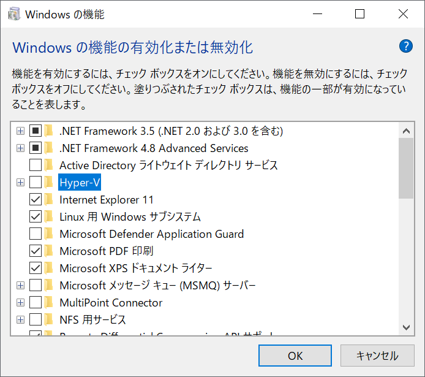

7. GNS3の起動

- 以下の画面が出る

 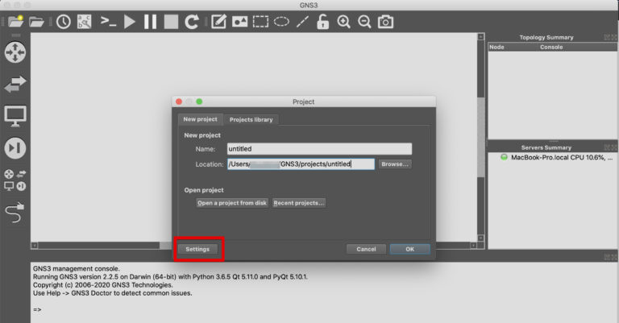 

 - SeverのEnable local serverにチェックを入れる

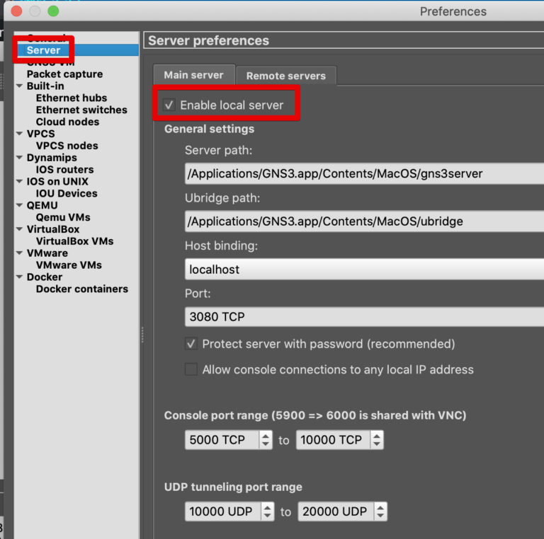

- GNS3 VMから以下を選択する

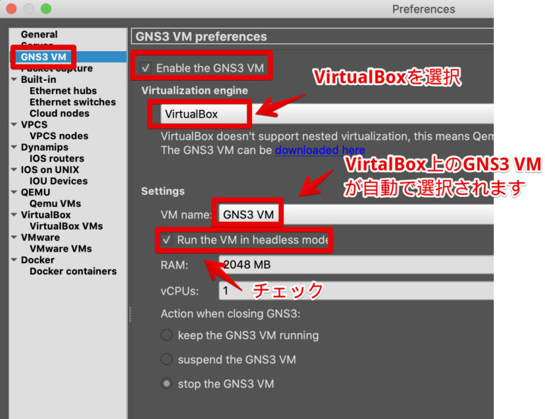

8. IOSイメージのインストール
  
- GNS3を立ち上げる
- プロジェクトを作成する
  
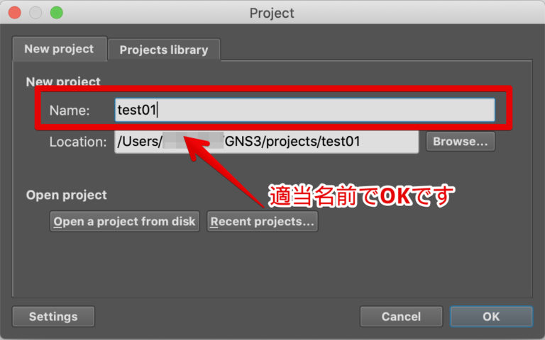

- routerをクリックしNewTemplateをクリック

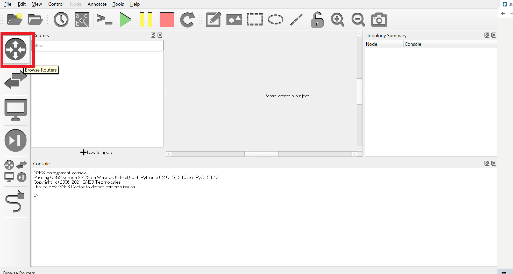

- IOS routersを選択して[New]から作成します

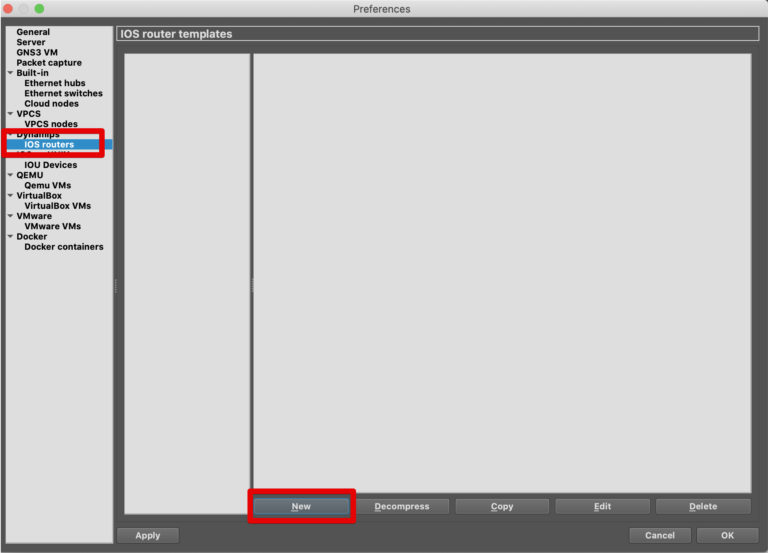

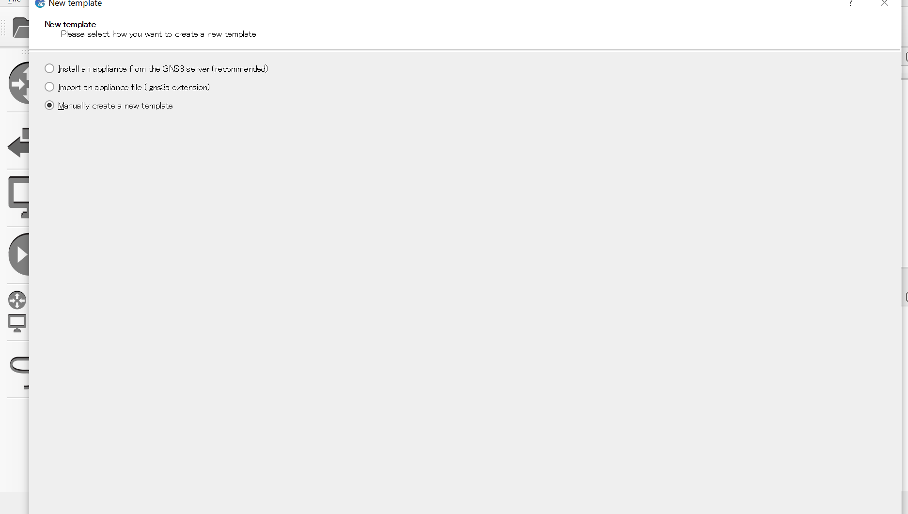

- インストールしたIOS入れて終了

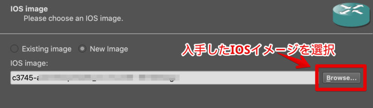

### 1.3.2. 動作確認してみよう！

- 以下のようにルータとケーブルをドラッグして接続しよう
  
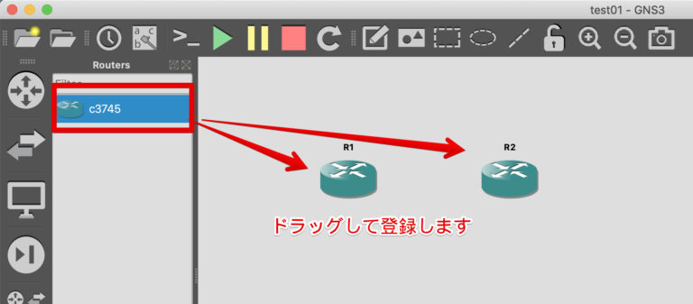

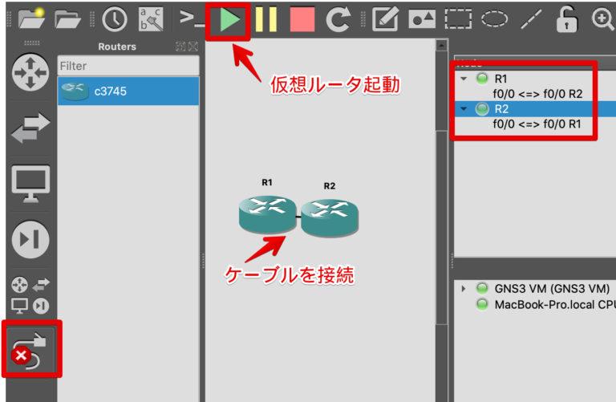

- routerをダブルクリックするとコンソールが開くので、R1,R2それぞれに打ち込んでみよう

```
R1#configure terminal
R1(config)#interface FastEthernet 0/0
R1(config-if)#ip address 192.168.1.1 255.255.255.0
R1(config-if)#no shutdown 
R1(config-if)#exit
R1(config)#exit
```

```
R2#configure terminal
R2(config)#interface fastEthernet 0/0
R2(config-if)#ip address 192.168.1.2 255.255.255.0
R2(config-if)#no shutdown 
R2(config-if)#exit
R2(config)#exit
R2#ping 192.168.1.1
```

そうするとpingが通るはずです