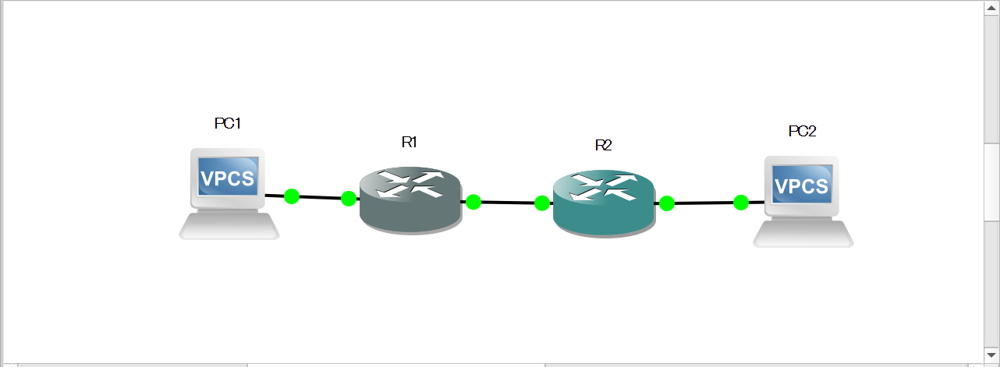
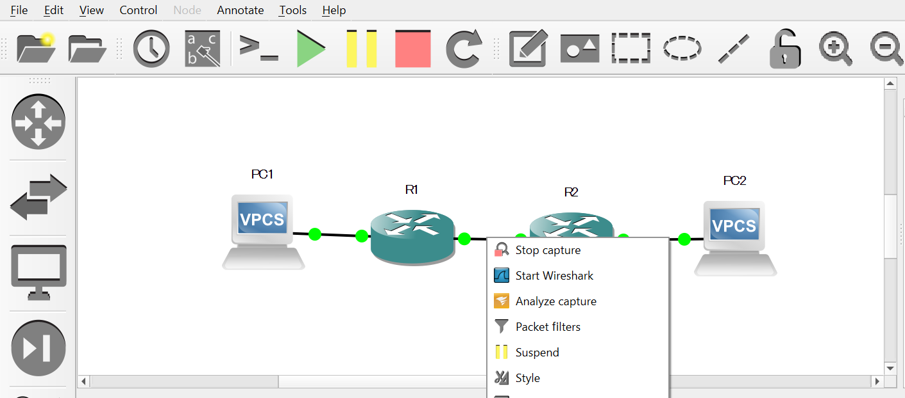

# GNS3の操作方法

## 目的

GNS3の初歩的な使い方を明らかにすることで、ネットワークの勉強効率をあげる

## 基本操作

- [ルータの初期設定](https://www.infraexpert.com/info/gns3z4.html)

- shiftを押しながら上下するとトポロジの形を崩さずに移動できる


- 空白をシフト＆ドラッグですばやく移動

## 操作例



- R1,R2をダブルクリックするとconsoleが立ち上がる

- R1側の設定

```cs
R1#configure terminal//特権モードから設定モードに変更
Enter configuration commands, one per line.  End with CNTL/Z.
R1(config)#interface ethernet 0/0//interfaceの設定
R1(config-if)#ip address 192.168.1.1 255.255.255.0//ipaddressの設定
R1(config-if)#no shutdown//interfaceの有効化
R1(config-if)#
*Mar  1 00:03:22.075: %LINK-3-UPDOWN: Interface Ethernet0/0, changed state to up
*Mar  1 00:03:23.076: %LINEPROTO-5-UPDOWN: Line protocol on Interface Ethernet0/0, changed state to up
R1(config-if)#exit
R1(config)#interface fastethernet 1/0
R1(config-if)#ip address 10.10.10.1 255.255.255.0
R1(config-if)#no shutdown
*Mar  1 00:04:09.533: %LINK-3-UPDOWN: Interface FastEthernet1/0, changed state to up
*Mar  1 00:04:10.534: %LINEPROTO-5-UPDOWN: Line protocol on Interface FastEthernet1/0, changed state to up
R1(config-if)#exit
R1(config)#router rip//ripを設定
R1(config-router)#version 2
R1(config-router)#no auto-summary//手動設定に変更
R1(config-router)#network 192.168.1.0
R1(config-router)#network 10.0.0.0
```

- R2側設定

```cs
R2#configure terminal
Enter configuration commands, one per line.  End with CNTL/Z.
R2(config)#interface ethernet 0/0
R2(config-if)#ip address 198.168.2.2 255.255.255.0
R2(config-if)#no shutdown
R2(config-if)#exi
*Mar  1 00:14:51.593: %LINK-3-UPDOWN: Interface Ethernet0/0, changed state to up
*Mar  1 00:14:52.595: %LINEPROTO-5-UPDOWN: Line protocol on Interface Ethernet0/0, changed state to up
R2(config-if)#exit
R2(config)#interface fastethernet 1/0
R2(config-if)#ip address 10.10.10.2 255.255.255.0
R2(config-if)#no shutdown
R2(config-if)#exit
*Mar  1 00:15:39.596: %LINK-3-UPDOWN: Interface FastEthernet1/0, changed state to up
*Mar  1 00:15:40.597: %LINEPROTO-5-UPDOWN: Line protocol on Interface FastEthernet1/0, changed state to up
R2(config)#router rip
R2(config-router)#version 2
R2(config-router)#no auto-summary
R2(config-router)#network 192.168.2.0
R2(config-router)#network 10.0.0.0
```

- wiresharkの使い方
  - ケーブルをクリックする
  - startを選択
